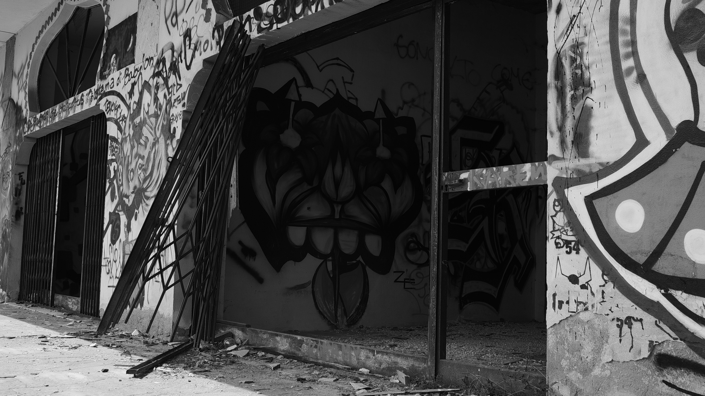

Consonno
========

.. post:: Aug 12, 2017
   :tags: photography
   :category:

A bunch of photos of my trip to the ghost town Consonno.

.. image:: _static/consonno/consonno-1.jpg

.. image:: _static/consonno/consonno-3.jpg
.. image:: _static/consonno/consonno-4.jpg

I've used a Canon 600D with the default 18-135mm lense, the photos were taken in
raw mode and then processed using RawTherapee_, an open source software I really
appreciate.

.. _RawTherapee: http://rawtherapee.com/
